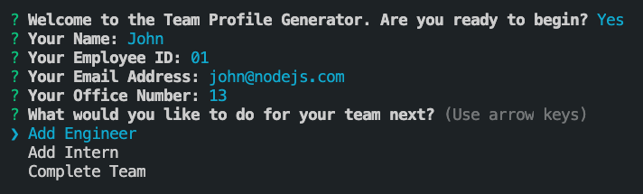
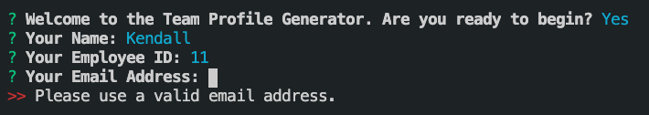
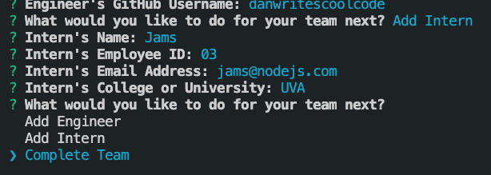
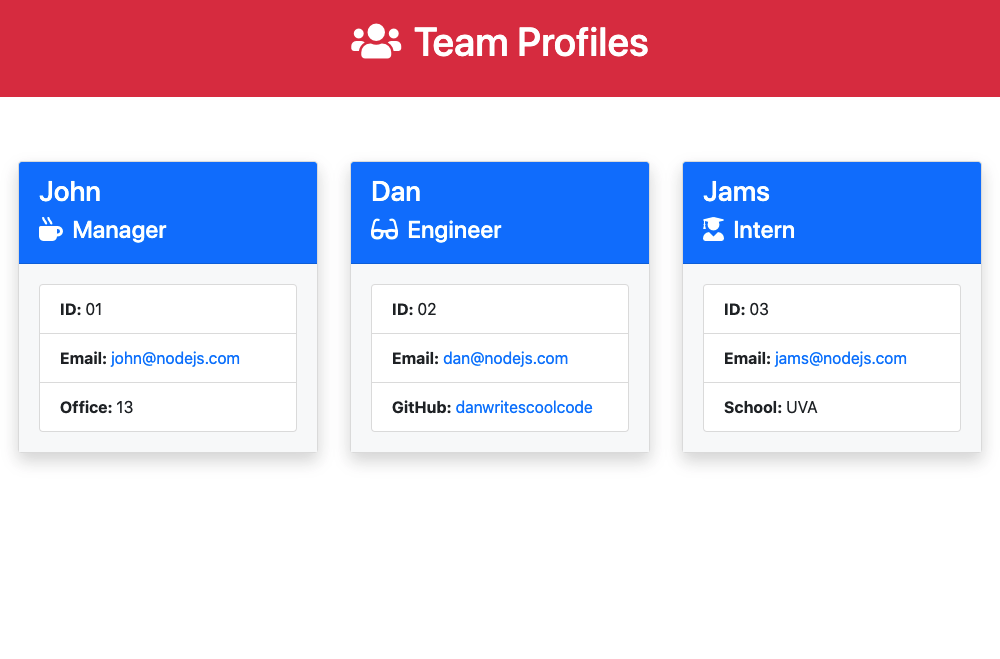

# Team Profile Generator


## Table of Contents
* [Description](#description)
* [Technologies](#technologies)
* [Installation](#installation)
* [Usage](#usage)
* [Application Demo](#application-demo)
* [Tests](#tests)
* [License](#license)
* [Contact](#contact)


## Description
The Team Profile Generator collects basic professional details about the members of a software development team using a series of command line prompts and outputs a clean, Bootstrap styled HTML document containing profile cards for each team member.


## Technologies
**Core Technologies:**  
Node.js, JavaScript, Inquirer.js, HTML, Bootstrap 4  

**Supplmentary Packages:**  
Outdent, js-beautify, Jest


## Installation
This application requires Node.js and npm to run. To check whether Node.js and npm are installed locally, run:
```
node -v
```
```
npm -v
```
If Node and npm are already installed, the commands above should return version numbers. Visit [Node.js](http://www.nodejs.org/) and [npm](https://docs.npmjs.com/downloading-and-installing-node-js-and-npm) for full installation details and documentation.  

The Team Profile Generator also requires the installation of several third-party modules including Inquirer.js, js-beautify, Outdent, and Jest. To install the project and its npm dependencies, navigate to the project's root directory and run:
```
npm install
```
Once all third-party packages have been successfully installed, the application is ready to use. For more details, reference the application's `package.json` file.


## Usage
To launch the application from the command line, navigate to the project's root directory and run:

```
node index.js
```


The application begins by collecting information for the team manager's profile (required) before presenting the user with options to add a profile for an engineer, add a profile for an intern, or exit the program:



While the application requires the creation of only a single manager profile, any number of engineer and intern profiles can be added to the team.  

Each prompt is supported by a response-specific validation function to prevent empty entries and ensure the information added to each profile is submitted in the correct format.



Once all team members have been added, the "Complete Team" option from the navigation menu will close the command line prompts:



Finally, the application formats the response data, generates HTML card components for each profile, inserts the entire deck of profile cards into a pre-styled HTML document, and writes the new document as `team-profiles.html` in the project's `/dist` folder.




## Tests
The Team Profile Generator uses the Jest testing framework. Each of the application's four primary classes has its own test suite to ensure successful profile instantiation and functionality. To run all four suites:
```
npm run test
```


## Application Demo
The following video documents the user journey from application launch through the generation of a pre-styled HTML document containing profile cards for each added team member. Use this video to supplement the documentation above: 

[](https://drive.google.com/file/d/1nJ2gbuWn2ufELPXuDB2jVWeGVIfOp53m/view)


## License
Copyright (c) 2021 J.K. Royston  
Licensed under the [MIT License](https://opensource.org/licenses/MIT).


## Contact
J.K. Royston  
<jkroyston@gmail.com>  
[GitHub](https://www.github.com/jxhnkndl)